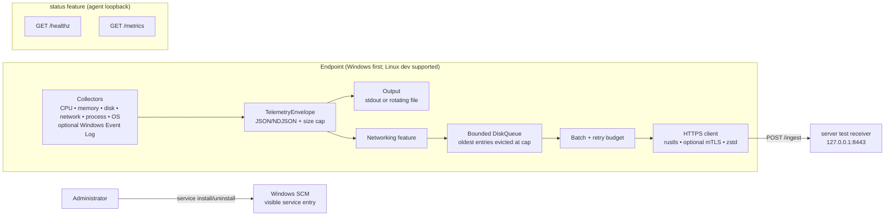

# 🦀 Rust Endpoint Agent (2025)

<p align="center">
  
  &nbsp;&nbsp;&nbsp;
  
</p>

**Windows-first, modular endpoint telemetry in Rust**, with transparent operation, optional HTTPS/mTLS transport, zstd batching, bounded disk buffering, and a documented Windows Service integration.

[](https://github.com/UsamaMatrix/rust-endpoint-agent-2025/actions/workflows/ci.yml)
[](LICENSE)


> **Authorized use only.** This project is designed for transparent endpoint administration and observability. It has no stealth mode, hidden watchdog, self-update mechanism, kernel driver, or undocumented persistence. Windows persistence is limited to a visible Service Control Manager entry.

## Highlights

- Collects CPU, memory, disks, network I/O, top-N processes, OS information, and optional Windows Event Log data.
- Emits bounded NDJSON envelopes to stdout or a rotating file.
- Optionally posts HTTPS batches using `reqwest`/rustls, zstd compression, mTLS material, and a bounded disk queue.
- Provides optional local `GET /healthz` and `GET /metrics` endpoints.
- Supports Windows Service install/uninstall subcommands; service code is compiled only for Windows.
- Uses Rust 2021, denies warnings in CI, and contains no `unsafe` code in the agent implementation.

## Architecture

The collector loop in `agent/src/collectors/mod.rs` refreshes `sysinfo`, serializes one bounded `TelemetryEnvelope` per collector, logs it, and optionally sends it to the networking channel. The transport task persists lines in `DiskQueue`, removes the oldest entries when the byte cap is exceeded, and periodically posts a batch. The local `server` binary is a TLS test receiver; it is separate from the agent's optional loopback status server.



> The test receiver currently configures server-side TLS without client authentication. The agent supports client certificates; use a separately configured mTLS-capable receiver when mutual authentication is required.

## Workspace layout

```text
agent/                    Endpoint agent binary and library
  src/main.rs              CLI and run/service dispatch
  src/config.rs            CLI/env/file configuration precedence
  src/collectors/          Telemetry collection and envelopes
  src/transport/           HTTPS/mTLS, queue, and status server
  src/service/              Windows SCM integration
server/                   Local HTTPS receiver for development
xtask/                    Certificate generation and developer lint helper
configs/agent.example.toml Example configuration
.github/workflows/ci.yml  Formatting, lint, tests, audit, SBOM, Windows build
Cargo.toml                Rust workspace and shared dependencies
deny.toml                 cargo-deny policy
```

## Stack and feature flags

The workspace targets Rust **1.75+** on the stable channel and uses Rust 2021. Important libraries include `tokio`, `sysinfo`, `serde`/`serde_json`, `reqwest` + rustls, `hyper`, `tracing`, `zstd`, and `clap`.

| Feature | Effect | Default |
| --- | --- | --- |
| `networking` | HTTPS sender, rustls client, optional zstd compression and queue | off |
| `status` | Loopback `/healthz` and `/metrics` server | off |
| `win-events` | Windows Event Log tailer hook | off |

## Quickstart (Linux development)

```bash
# Stable Rust, rustfmt, and clippy are selected by rust-toolchain.toml
cargo run -p xtask -- certs --dns 127.0.0.1

# Terminal 1: local HTTPS test receiver
RUST_LOG=server=info cargo run -p server -- \
  configs/certs/server.crt configs/certs/server.key

# Terminal 2: agent with networking and status endpoints
RUST_LOG=info cargo run -p agent --features "networking,status" -- \
  --config configs/agent.example.toml \
  --enable-networking \
  --status-port 9100

curl -s http://127.0.0.1:9100/healthz
curl -s http://127.0.0.1:9100/metrics
```

The agent runs until interrupted with `Ctrl+C`. Configuration precedence is **CLI → environment → file → defaults**. Supported examples include `REA_CONFIG`, `REA_ENABLE_NETWORKING`, and `REA_INTERVAL_SECS`.

### Developer checks

```bash
cargo fmt --all -- --check
cargo clippy --all-targets -- -D warnings
cargo test --all --all-features --no-fail-fast
cargo audit
cargo deny check
```

`cargo run -p xtask -- lint` runs formatting and clippy. `cargo-about` generates the SBOM used by CI from `.about/about.hjson`.

## Windows GNU build

```bash
sudo apt update
sudo apt install -y mingw-w64 gcc-mingw-w64-x86-64 zstd
rustup target add x86_64-pc-windows-gnu
mkdir -p .cargo
printf '[target.x86_64-pc-windows-gnu]\nlinker = "x86_64-w64-mingw32-gcc"\n' > .cargo/config.toml
cargo build --release -p agent --target x86_64-pc-windows-gnu
sha256sum target/x86_64-pc-windows-gnu/release/agent.exe
```

The CI workflow uploads `agent.exe` and its checksum and attempts a build-provenance attestation. On Windows, a built executable can be installed transparently from an elevated PowerShell prompt:

```powershell
.\agent.exe service install --display-name "Rust Endpoint Agent" --config "C:\ProgramData\REA\agent.toml"
Start-Service "Rust Endpoint Agent"
Stop-Service "Rust Endpoint Agent"
.\agent.exe service uninstall
```

## CI status and troubleshooting

CI is defined in [`.github/workflows/ci.yml`](.github/workflows/ci.yml). The `lint-test-audit` job runs fmt, clippy, all-feature tests, `cargo-audit`, `cargo-deny`, and SBOM generation. `build-windows-gnu` cross-compiles the agent, creates a SHA-256 checksum, uploads the artifact, and attests it.

The latest displayed failures were associated with Dependabot commit [`d31fc65`](https://github.com/UsamaMatrix/rust-endpoint-agent-2025/commit/d31fc656cb00602b5913e5cdd4e02f31ca080c0c), which only changes `actions/upload-artifact` from v4 to v6. The two failed runs are [lint/test/audit](https://github.com/UsamaMatrix/rust-endpoint-agent-2025/actions/runs/20246545680) and [Windows GNU build](https://github.com/UsamaMatrix/rust-endpoint-agent-2025/actions/runs/20246546480). Because the available check summary does not expose step-level logs, the exact compiler/action error must be confirmed in the **Details** view before treating the action bump as the root cause. Reproduce the code portion locally with the commands above; inspect the failed step first rather than disabling the security checks.

## Security model

- TLS uses rustls; client certificates and CA roots are optional configuration.
- JSON event size, batch size, queue size, and retry budget are bounded.
- No kernel drivers, hidden persistence, stealth, self-update, or unsafe agent code.
- Report vulnerabilities using the process in [`SECURITY.md`](SECURITY.md).

## Contributing and license

See [`CONTRIBUTING.md`](CONTRIBUTING.md) and [`CODE_OF_CONDUCT.md`](CODE_OF_CONDUCT.md). Contributions must remain aligned with transparent, authorized endpoint telemetry. Licensed under [Apache-2.0](LICENSE).
